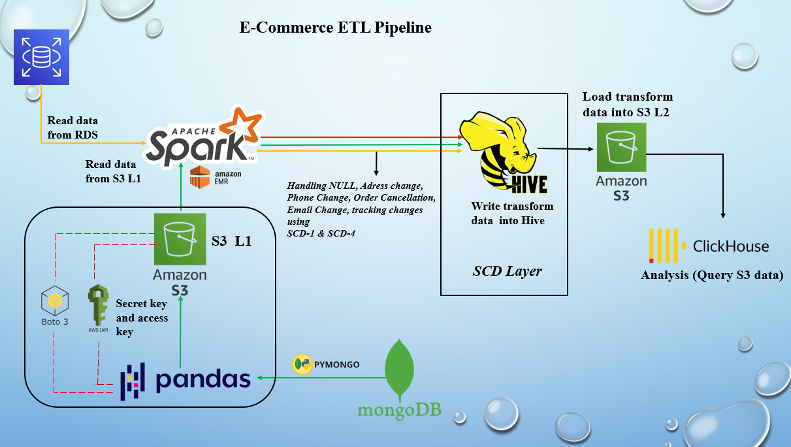

<!-- HEADER -->
<h1 align="center">🛒 E-Commerce ETL Pipeline</h1>

  <b>Scalable End-to-End Data Engineering Project</b> 
  Built with AWS, Apache Spark, Hive & ClickHouse

  
  
  
  
  

---

<!-- PROJECT OVERVIEW -->
<h2>📌 Project Overview</h2>

This project demonstrates a <b>complete end-to-end ETL pipeline</b> for processing 
e-commerce data using distributed and cloud-native technologies. It integrates 
<b>structured data (AWS RDS)</b> and <b>semi-structured data (MongoDB)</b>, processes it 
using <b>Apache Spark</b>, and enables high-performance analytics using <b>ClickHouse</b>.

---

<!-- ARCHITECTURE -->
<h2>🏗️ Architecture</h2>

  

---

<!-- TECH STACK -->
<h2>🧩 Tech Stack</h2>

<table>
<tr>
  <td><b>☁️ Cloud</b></td>
  <td>Amazon S3, AWS RDS, EMR</td>
</tr>
<tr>
  <td><b>⚙️ Processing</b></td>
  <td>Apache Spark (PySpark), Hadoop</td>
</tr>
<tr>
  <td><b>🗄️ Storage</b></td>
  <td>Hive, S3 (L1 & L2)</td>
</tr>
<tr>
  <td><b>📊 Analytics</b></td>
  <td>ClickHouse</td>
</tr>
<tr>
  <td><b>🐍 Programming</b></td>
  <td>Python, Pandas, PyMongo, Boto3</td>
</tr>
</table>

---

<!-- DATA PIPELINE FLOW -->
<h2>🔄 Data Pipeline Flow</h2>

<ul>
  <li>📥 Extract data from <b>AWS RDS</b> via JDBC</li>
  <li>📥 Ingest JSON data from <b>MongoDB → S3 (L1)</b></li>
  <li>⚙️ Process & transform data using <b>Apache Spark</b></li>
  <li>🧪 Apply validation & SCD tracking</li>
  <li>📤 Load processed data into <b>Hive & S3 (L2)</b></li>
  <li>📊 Query optimized data using <b>ClickHouse</b></li>
</ul>

---

<!-- RESPONSIBILITIES -->
<h2>🧠 Key Responsibilities</h2>

<h3>1️⃣ Data Ingestion</h3>
<ul>
  <li>Extracted data from AWS RDS using JDBC</li>
  <li>Ingested MongoDB JSON data using Pandas + PyMongo</li>
  <li>Uploaded data into Amazon S3 (Layer 1)</li>
</ul>

<h3>2️⃣ Data Transformation</h3>
<ul>
  <li>Combined RDS & MongoDB datasets</li>
  <li>Applied joins, aggregations, filtering</li>
  <li>Created derived business columns</li>
</ul>

<h3>3️⃣ Data Validation</h3>
<ul>
  <li>NULL checks, duplicate removal, schema validation</li>
  <li>Tracked changes using <b>SCD Type 1 & Type 4</b></li>
</ul>

<h3>4️⃣ Data Loading</h3>
<ul>
  <li>Stored processed data in Hive tables</li>
  <li>Exported clean data to S3 (Layer 2)</li>
</ul>

<h3>5️⃣ Analytics</h3>
<ul>
  <li>Queried data using ClickHouse for fast analytics</li>
</ul>

---

<!-- KPI SECTION -->
<h2>📊 Business KPIs</h2>

<b>💰 Average Order Value</b>

<b>🔁 Repeat Customers</b>

<b>❌ Cancellation Rate</b>

<b>📦 Daily Orders</b>

<b>✅ Success Rate</b>

<b>🏆 Top Customers</b>

---

<!-- PROJECT STRUCTURE -->
<h2>🗂️ Project Structure</h2>

<pre>
E-Commerce-ETL/
│
├── RDTOSPARK.py
├── MONGOtoS3L1.py
├── S3L1toSPARK.py
├── VALIDATION.py
├── BUSINESSKPI.py
├── SPARKtoHIVE.py
├── HIVEtoS3L2.py
├── S3L1toCLICKHOUSE.py
├── ProjectArchitecture.png
└── README.md
</pre>

---

<!-- HIGHLIGHTS -->
<h2>🚀 Key Highlights</h2>

<ul>
  <li>✔️ Hybrid data ingestion (RDS + MongoDB)</li>
  <li>✔️ Scalable distributed processing using Spark</li>
  <li>✔️ Data lake architecture (S3 L1 & L2)</li>
  <li>✔️ SCD implementation for historical tracking</li>
  <li>✔️ High-performance analytics using ClickHouse</li>
</ul>

---

<!-- FOOTER -->

  ⭐ If you like this project, give it a star on GitHub!

